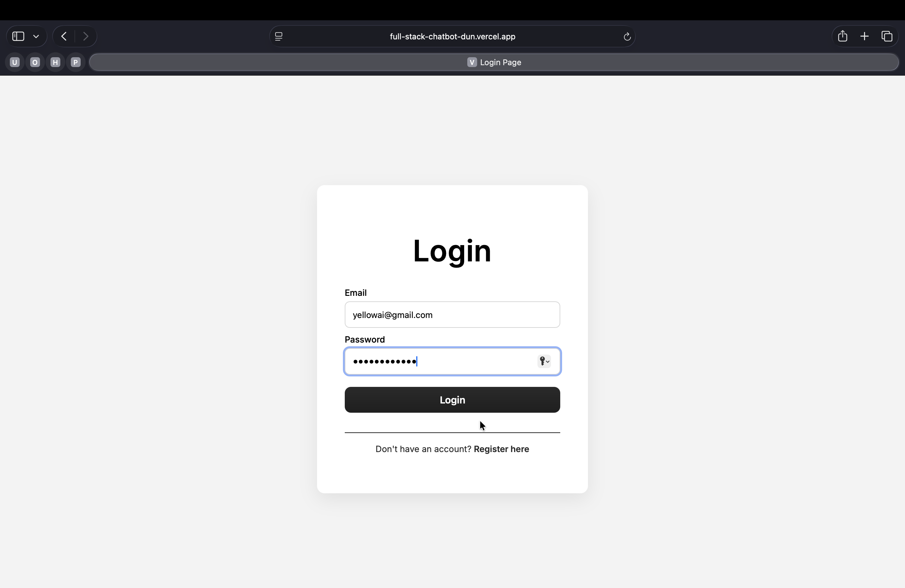
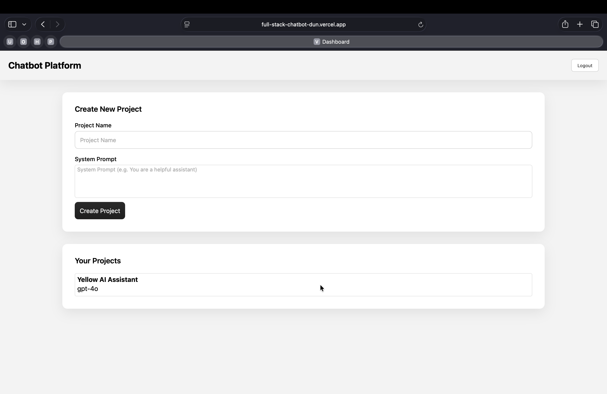
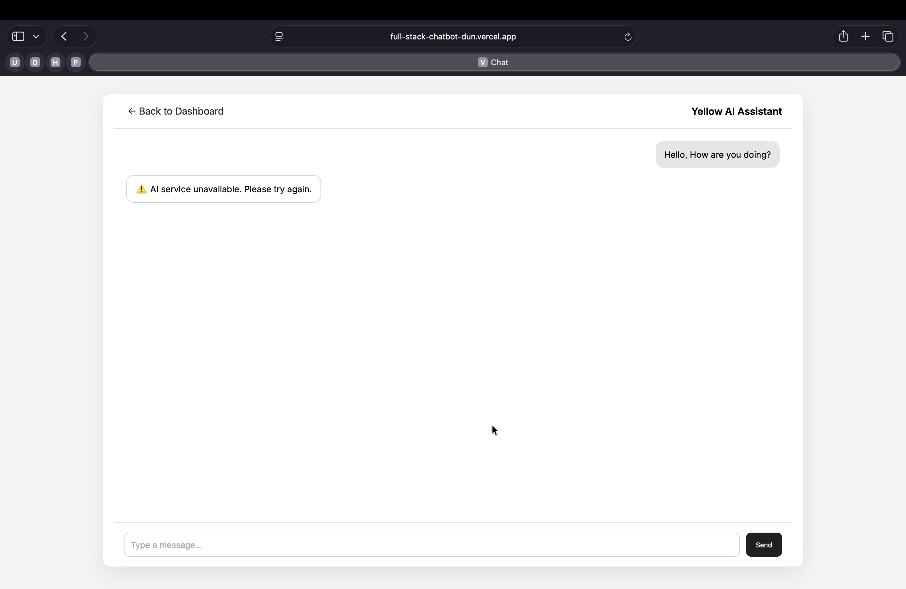

# Full-Stack-Chatbot

A full-stack AI chatbot platform that allows users to create projects, chat with an AI model, and manage conversation history.
Built with Spring Boot, MongoDB, and Vanilla JavaScript, and integrated with a Large Language Model (LLM) provider.

## 🚀 Live Demo

Frontend (Vercel):
https://full-stack-chatbot-dun.vercel.app/

Backend (Render):
https://full-stack-chatbot-3.onrender.com

## Screenshots

### Signup Page


### Login Page


### Dashboard


### Chat Interface


## Features
</br>
✅ JWT-based authentication (Register / Login)</br>
✅ AI-powered chat per project</br>
✅ Persistent chat history (MongoDB)</br>
✅ Clean REST API design</br>
✅ Chat History Management</br>
✅ Secure API Endpoints</br>
✅ CORS Configuration</br>
✅ Pluggable LLM provider (extensible architecture)</br>

## 🛠 Tech Stack

✅**Frontend**</br>
HTML5</br>
CSS3</br>
Vanilla JavaScript</br>
Hosted on Vercel</br>

✅**Backend**</br>
Java 17</br>
Spring Boot 3</br>
Spring Security (JWT)</br>
Spring Data MongoDB</br>
WebClient (for AI API calls)</br>
Hosted on Render</br>

✅**Database**</br>
MongoDB Atlas (Cloud)</br>

✅**AI / LLM**</br>
Groq API (OpenAI-compatible)</br>
Model: mixtral-8x7b-32768</br>
Easily replaceable with other providers (OpenAI / Hugging Face / OpenRouter)</br>

## 🏗 Architecture Overview

```
┌─────────────────────────────────────────────────────────────┐
│                      React Frontend                          │
│                    (Port 3000/5173)                          │
└───────────────────────┬─────────────────────────────────────┘
                        │ HTTP/REST API
                        │ JWT Auth
                        ▼
┌─────────────────────────────────────────────────────────────┐
│                   Spring Boot Backend                        │
│                      (Port 8080)                             │
├─────────────────────────────────────────────────────────────┤
│  ┌──────────────────┐  ┌──────────────────┐                │
│  │   Controllers    │  │   Security       │                │
│  │  - Auth          │  │  - JWT Filter    │                │
│  │  - Project       │  │  - CORS Config   │                │
│  │  - Chat          │  │  - Auth Entry    │                │
│  └────────┬─────────┘  └────────┬─────────┘                │
│           │                     │                            │
│           ▼                     ▼                            │
│  ┌──────────────────┐  ┌──────────────────┐                │
│  │    Services      │  │   Repositories   │                │
│  │  - AuthService   │  │  - UserRepo      │                │
│  │  - ProjectSvc    │  │  - ProjectRepo   │                │
│  │  - ChatService   │  │  - MessageRepo   │                │
│  └────────┬─────────┘  └────────┬─────────┘                │
│           │                     │                            │
└───────────┼─────────────────────┼────────────────────────────┘
            │                     │
            │                     ▼
            │            ┌──────────────────┐
            │            │    MongoDB       │
            │            │  - users         │
            │            │  - projects      │
            │            │  - messages      │
            │            └──────────────────┘
            │
            ▼
   ┌──────────────────┐
   │   GROQ API       │
   │  GPT-4o/3.5      │
   └──────────────────┘

```

## Project Structure

```
CHATBOT-ASSESS
│
├── Backend
│   ├── .mvn/
│   ├── src/
│   │   ├── main/
│   │   │   ├── java/
│   │   │   │   └── com/chatbot/
│   │   │   │       ├── controller/
│   │   │   │       │   ├── AuthController.java
│   │   │   │       │   ├── ProjectController.java
│   │   │   │       │   └── ChatController.java
│   │   │   │       │
│   │   │   │       ├── service/
│   │   │   │       │   ├── AuthService.java
│   │   │   │       │   ├── ProjectService.java
│   │   │   │       │   └── ChatService.java
│   │   │   │       │
│   │   │   │       ├── repository/
│   │   │   │       │   ├── UserRepository.java
│   │   │   │       │   ├── ProjectRepository.java
│   │   │   │       │   └── MessageRepository.java
│   │   │   │       │
│   │   │   │       ├── model/
│   │   │   │       │   ├── User.java
│   │   │   │       │   ├── Project.java
│   │   │   │       │   └── Message.java
│   │   │   │       │
│   │   │   │       ├── dto/
│   │   │   │       │   ├── AuthDTOs.java
│   │   │   │       │   ├── ProjectDTOs.java
│   │   │   │       │   └── ChatDTOs.java
│   │   │   │       │
│   │   │   │       ├── config/
│   │   │   │       │   ├── SecurityConfig.java
│   │   │   │       │   └── CorsConfig.java
│   │   │   │       │
│   │   │   │       ├── security/
│   │   │   │       │   ├── JwtUtil.java
│   │   │   │       │   └── JwtAuthenticationFilter.java
│   │   │   │       │
│   │   │   │       └── ChatbotPlatformApplication.java
│   │   │   │
│   │   │   └── resources/
│   │   │       ├── application.properties
│   │   │       └── static/
│   │   │
│   │   └── test/
│   │
│   ├── target/
│   ├── .gitignore
│   ├── Dockerfile
│   ├── mvnw
│   ├── mvnw.cmd
│   ├── pom.xml
│   └── README.md
│
├── Front-End
│   ├── index.html          # Signup / Landing page
│   ├── login.html
│   ├── login.css
│   ├── login.js
│   ├── signup.css
│   ├── signup.js
│   │
│   ├── dashboard.html
│   ├── dashboard.css
│   ├── dashboard.js
│   │
│   ├── chat.html
│   ├── chat.css
│   ├── chat.js
│   │
│   └── images/
│
└── README.md
```

## 🧪 Error Handling & Security
Graceful AI API failures</br>
JWT expiration handling</br>
Unauthorized access redirects</br>
Centralized exception handling</br>
Secure password hashing (BCrypt)</br>

## 📌 Future Improvements
Streaming AI responses</br>
Role-based access control</br>
File upload support</br>
Chat export</br>
WebSocket support</br>
Rate limiting</br>

## 👨‍💻 Author

**Shivanand Mirji**</br>
GitHub: https://github.com/Shivamirji36